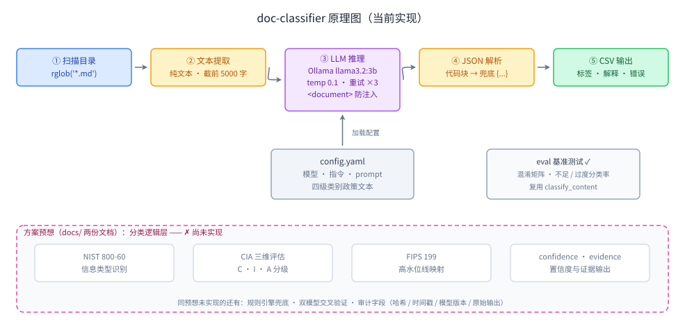

# doc-classifier 分类逻辑层设计方案（NIST 800-60 + CIA 映射）

> 日期：2026-10-07 · 状态：方案评审中（未动代码）
> 关联文档：[llm-file-classification-research.md](../analysis/llm-file-classification-research.md) ·
> [deepseek-analysis-report.md](../analysis/deepseek-analysis-report.md) ·
> 原理图：

## 一、背景与现状结论

对照 docs/ 两份方案预想核查当前实现（详见原理图）：

- **已落地**：Meta 架构骨架最简版（提取 → LLM 推理 → 打标）、四级体系、
  Ollama 本地化、`<document>` 提示注入防御、eval 基准（混淆矩阵 +
  不足/过度分类率，超出方案预想）。
- **未落地**：方案宣称的差异化价值——"分类逻辑层自己写
  （NIST 800-60 + CIA 映射）"。现状是 Meta ClassifyIt 式政策类别单步归类：
  政策文本进 prompt，LLM 直接吐标签；无信息类型识别、无 CIA 三维评估、
  无高水位线映射、无置信度。

## 二、核心思路

**LLM 只做语义判断，代码做全部裁决。**

LLM 负责"文档里有什么信息类型、每类 C/I/A 影响是几级"；
"评级如何汇总成最终标签"由纯 Python 函数按 FIPS 199 高水位线计算。
映射逻辑可审计、可单测、不随模型波动——这是与 Meta ClassifyIt
（LLM 直出标签）的本质区别，即本框架的差异化价值。

## 三、职责划分

| 步骤 | 方案预想 | 谁来做 | 现状 |
|---|---|---|---|
| ① 信息类型识别 | NIST 800-60 类型目录 | **LLM**（从目录匹配 + 报告未收录类型） | ❌ |
| ② CIA 三维评级 | 每类型 C/I/A = Low/Moderate/High | **LLM 提议 + 目录基线兜底** | ❌ |
| ③ 高水位线映射 | 取三维/各类最高值 | **代码**（纯函数） | ❌ |
| ④ SC → 四级标签 | 低/中/高 → public…confidential | **代码**（配置表驱动） | ❌ |
| ⑤ 置信度与复核 | 低置信度触发人工复核 | **代码**（阈值判断） | ❌ |

## 四、数据流

```
文档 → LLM（单次调用，分步推理 prompt）
     → { information_types: [{type, c, i, a, confidence, evidence}],
         suggested_label, explanation }          ← LLM 输出（提议）
     → logic.py 裁决：
         每维评级 = max(LLM 评级, 目录基线)       ← 防不足分类
         SC = (max C, max I, max A)              ← FIPS 199 高水位线
         label = SC 映射表                        ← 配置驱动
     → needs_review = 置信度低 ∨ 有"待归类"类型 ∨ label ≠ suggested_label
     → CSV（新增列：sc_c/sc_i/sc_a, types, confidence, needs_review）
```

## 五、三块改动

### 1. `logic.py`（新增，纯函数，不碰网络）

```python
def resolve(analysis: dict, catalog: dict, rules: dict) -> dict:
    """评级校验 → 高水位线 → 标签映射 → 复核标记。纯函数，pytest 直接覆盖。"""
    # 每维：max(LLM rating, catalog baseline)，未知类型用 LLM 评级并标记待归类
    # SC = 逐维取各类最大值；查 rules 表得 label
    # needs_review：confidence < 阈值 / 有 unmapped 类型 / label != suggested_label
```

### 2. `config.yaml`（扩展，不新增配置文件）

```yaml
logic:
  review_confidence: 0.7
  level_rules:            # 高水位线聚合级 → 业务标签（组织策略，可改）
    high: confidential
    moderate: restricted
    low: internal         # 全部类型命中 public 标记 → public
  information_types:      # 种子目录（NIST 800-60 相关子集，组织可增补）
    员工客户PII:  {c: high,    i: moderate, a: low, evidence_hint: "身份证/银行账号/绩效"}
    凭证密钥:     {c: high,    i: high,     a: high}
    财务经营数据: {c: moderate, i: moderate, a: low}
    知识产权规格: {c: moderate, i: moderate, a: moderate}
    会议纪要制度: {c: moderate, i: low,      a: low}
    公开发布信息: {c: low,     i: low,      a: low, public: true}
```

不搬 NIST 800-60 全量 80+ 类型——先放业务相关种子 + "待归类"逃生口
（LLM 遇到目录外类型 → 报告特征与建议评级 → 人工入库），
即 docs 预想的组织特有类型流程。

### 3. prompt v2（改 config 现有字段）

强制三步输出："列出信息类型（含目录外待归类）→ 逐类型给 C/I/A + 证据 →
建议标签"。JSON schema 加 `information_types[]`、`suggested_label`、
`confidence`、`evidence`。`<document>` 防注入原样保留。

## 六、模型选择：qwen2.5:7b（本地）

从 llama3.2:3b 调整为本地 qwen2.5:7b，理由与影响：

1. **落入 docs 推荐路径**：deepseek-analysis-report 的 MVP 建议
   即"本地部署 Qwen2.5-7B（中文能力强，已确认存在）"。
2. **单次调用设计更稳**：7B 的结构化 JSON 遵从度与中文能力显著更好，
   CIA 逐维评级（3B 最易出错的环节）可信度提升，原"拆两次调用"的
   升级路径取消。
3. **改动点**：`config.yaml` 模型名一行 + `README.md` pull 命令；
   `main.py` 无需改（OpenAI 兼容接口，模型名是配置项）。
   部署：7B Q4 约需 6GB 显存/内存；qwen2.5 支持 32K 上下文，
   `content[:5000]` 截断暂不动，eval 显示截断丢信息再调。

## 七、分步实施（每步可验证）

| 步骤 | 内容 | 验证 |
|---|---|---|
| **0** | 拉取 qwen2.5:7b、改 config 模型名，在**现有管线**上跑 eval levels + pii | 得到 7B 新基线（准确率/不足分类率） |
| 1 | 写 `logic.py` + 单测（高水位线、基线兜底、待归类、冲突标记） | `uv run pytest`，纯逻辑不需要 Ollama |
| 2 | config 加种子目录 + level_rules | yaml 可加载，单测覆盖映射表 |
| 3 | prompt v2 + `classify_content` 接入裁决，返回值保留 `category_matched` 键 | 扩展现有 FakeClient 测试 |
| 4 | CSV 新列 + `eval/run_eval.py` 适配 | eval levels 模式跑通 |
| 5 | eval 前后对比 | **不足分类率不升高**（安全红线），待归类率可接受 |

> 步骤 0 的意义：换模型与换逻辑层分开归因，避免 eval 前后对比混淆变量。

## 八、风险与升级路径

- **基线兜底方向**：`max(LLM, 目录基线)` 只防不足分类、放任过度分类；
  评估时盯过度分类率，必要时改为"LLM 可下调但需 evidence"。
- **eval 兼容**：`run_eval.py` 只用 `["category_matched"]`，
  返回结构保留该键即可，零改动或一行适配。
- **seed 目录覆盖不足**：待归类率偏高时增补类型即可（纯配置变更）。
